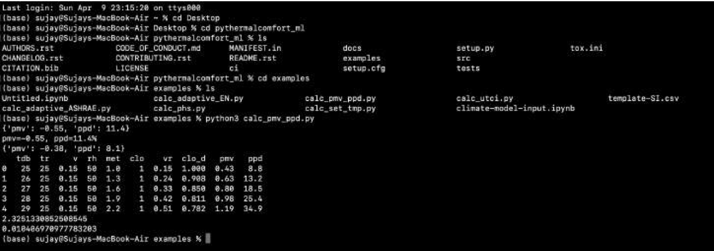

# Providing Thermal Comfort at Home/Office Automation


This project aims to enhance thermal comfort in home and office environments through automation. By leveraging semi-supervised algorithms and the `pythermalcomfort` library, the project assesses the thermal comfort of individuals within rooms. It utilizes Support Vector Regression (SVR) for Predicted Mean Vote (PMV) calculations and classifies thermal sensation levels based on ASHRAE standards, while also introducing innovations to the UC Berkeley "pythermalcomfort" package.

## Features

- Assesses thermal comfort using SVR (PMV) calculations.
- Classifies thermal sensation levels with semi-supervised algorithms.
- Adapts to the standards set by ASHRAE for comprehensive analysis.
- Introduces enhancements to the "pythermalcomfort" package from UC Berkeley.

## Installation

1. Clone this repository.

   ```bash
   git clone https://github.com/sujaykumarmag/PMV_PPD.git
   cd PMV_PPD

2. Install all the Packages
   
   ```bash
    pip3 install --upgrade -r requirements.txt

3. Run the Python Script
   
   ```bash
    python pmv_ppd.py
   
## Results


